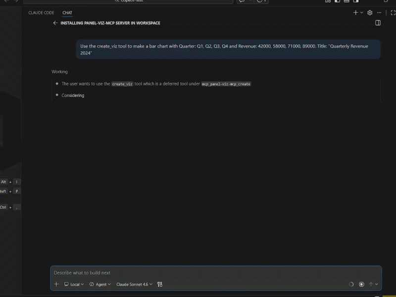
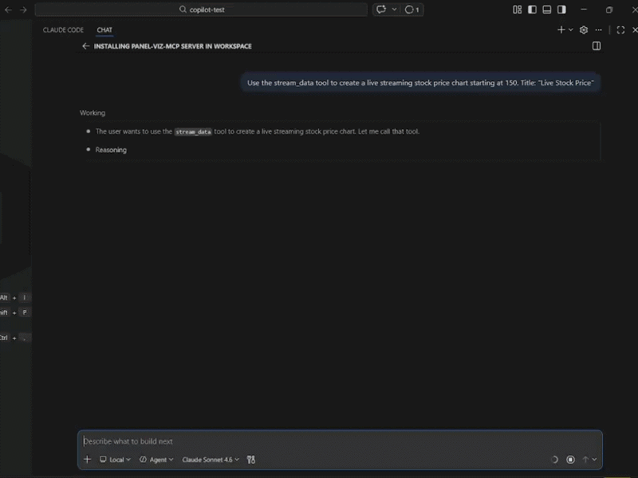
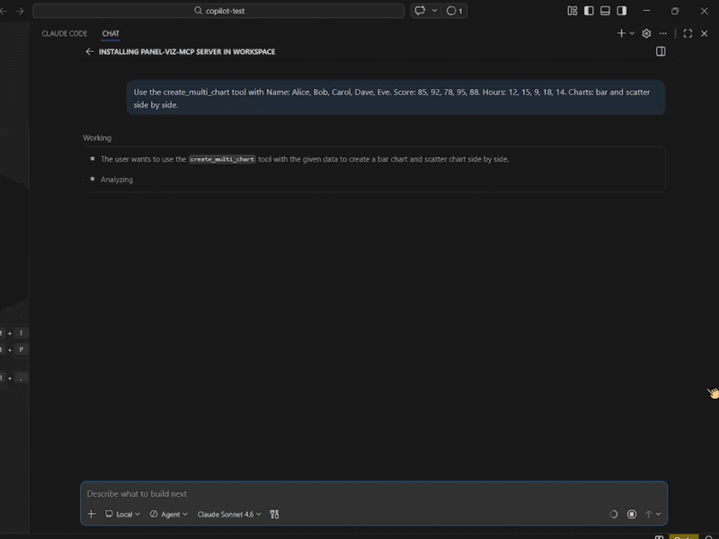
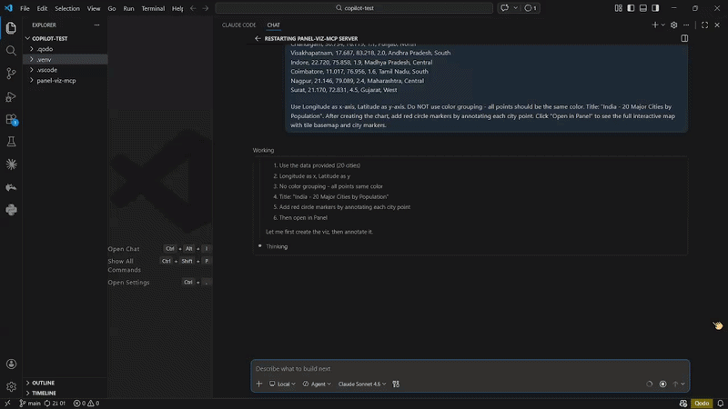
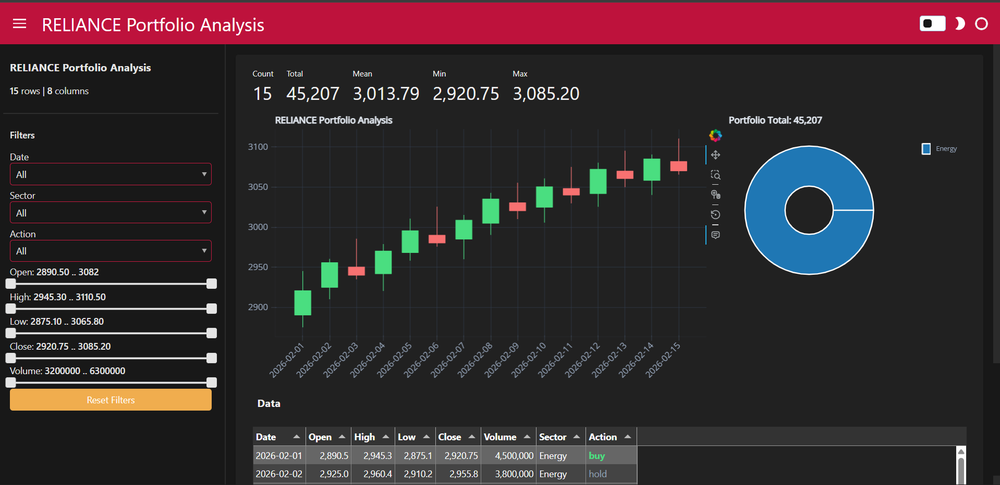
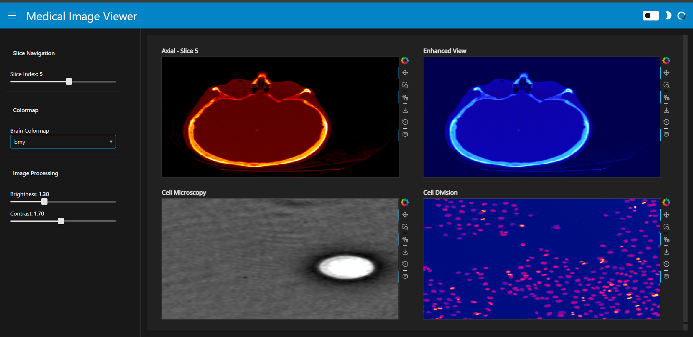
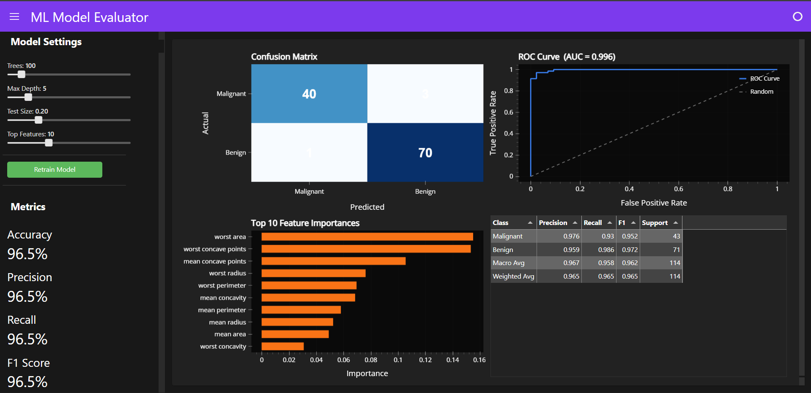
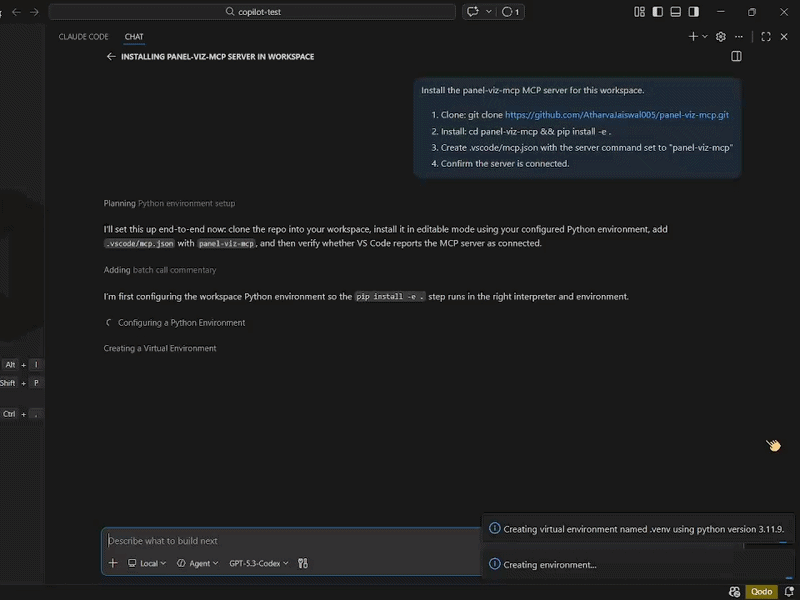

<p align="center">
  
</p>

<h1 align="center">panel-viz-mcp</h1>

<p align="center">
  Interactive <a href="https://panel.holoviz.org/">Panel</a> / <a href="https://holoviews.org/">HoloViews</a> visualizations rendered directly inside AI chat UIs via the <a href="https://github.com/modelcontextprotocol/ext-apps">MCP Apps Standard</a>.
</p>

<p align="center">
  Built with <a href="https://github.com/jlowin/fastmcp">FastMCP</a> &middot; <a href="https://hvplot.holoviz.org/">hvPlot</a> &middot; <a href="https://bokeh.org/">Bokeh</a> &middot; <a href="https://panel.holoviz.org/">Panel</a>
</p>

<p align="center">
  <strong>14 chart types</strong> &middot; <strong>15 MCP tools</strong> &middot; <strong>4 interactive UI resources</strong> &middot; <strong>bidirectional communication</strong>
</p>

---

## Showcase

### Inline Charts in AI Chat

Type a prompt, get an interactive chart rendered directly in the conversation.



### Live Streaming

Real-time data simulation with play/pause controls - all rendered inline.



### Multi-Chart Grid

Side-by-side chart comparison from the same dataset.



### Geographic Maps

Interactive maps with tile basemaps, launched via "Open in Panel".



### Candlestick Portfolio Dashboard

Full OHLC candlestick chart with donut pie breakdown, styled Tabulator table with colored buy/sell/hold signals, Number indicators, and crossfiltering sidebar - all generated from a single prompt.



### Medical Image Viewer

Real brain MRI data (scikit-image), 2x2 grid with multiple colormaps, slice navigation, brightness/contrast controls - built via `create_panel_app`.



### ML Model Evaluator

Interactive ML dashboard with confusion matrix, ROC curve, feature importances, classification report, and a "Retrain Model" button that retrains a RandomForest with new hyperparameters and updates all 4 panels live.



---

> **[9 Demo Prompts](demos/DEMO_SCRIPT.md)** - Ready-to-use prompts with full data included. From simple bar charts to candlestick portfolio dashboards, medical image viewers, and ML model evaluators. Just copy, paste, and run.

---

## What is this?

An MCP server that lets AI assistants create, modify, and render interactive visualizations **inline** in the chat conversation. Charts render as live BokehJS figures inside sandboxed iframes - not static images, not external links.

Works with any MCP Apps-compatible client:
- **VS Code Copilot Chat** (recommended - best inline iframe rendering)
- **Claude Desktop / Claude Code**
- **Cursor**
- **ChatGPT** (Business/Enterprise/Edu)
- **Goose**

## Quick Start

### Install

```bash
git clone https://github.com/AtharvaJaiswal005/panel-viz-mcp.git
cd panel-viz-mcp
pip install -e .
```

For geographic maps: `pip install -e ".[geo]"`

### Connect to your client

<details>
<summary><strong>VS Code / Copilot Chat (Recommended)</strong></summary>

Create `.vscode/mcp.json` in your project folder:

```json
{
  "servers": {
    "panel-viz-mcp": {
      "command": "panel-viz-mcp"
    }
  }
}
```

Open Copilot Chat (**Ctrl+Shift+I**), switch to **Agent** mode, and you're ready.
</details>

<details>
<summary><strong>Claude Code</strong></summary>

```bash
claude mcp add panel-viz-mcp -- panel-viz-mcp
```
</details>

<details>
<summary><strong>Claude Desktop</strong></summary>

Open **Settings > Developer > Edit Config** and add:

```json
{
  "mcpServers": {
    "panel-viz-mcp": {
      "command": "panel-viz-mcp"
    }
  }
}
```

Save and **restart** Claude Desktop.
</details>

<details>
<summary><strong>Cursor / Goose / Other Clients</strong></summary>

Use stdio transport with command `panel-viz-mcp`.
</details>

### Or let the agent install it for you

Paste one prompt and the AI agent handles everything - clone, install, configure, verify.



<details>
<summary><strong>VS Code Copilot Chat prompt</strong></summary>

```
Install the panel-viz-mcp MCP server for this workspace.
1. Clone: git clone https://github.com/AtharvaJaiswal005/panel-viz-mcp.git
2. Install: cd panel-viz-mcp && pip install -e .
3. Create .vscode/mcp.json with the server command set to "panel-viz-mcp"
4. Confirm the server is connected.
```
</details>

<details>
<summary><strong>Claude Code prompt</strong></summary>

```
Install the panel-viz-mcp MCP server.
1. Clone: git clone https://github.com/AtharvaJaiswal005/panel-viz-mcp.git
2. Find my Python path (run "where python" on Windows or "which python3" on Mac/Linux)
3. Install: cd panel-viz-mcp && pip install -e .
4. Register: claude mcp add panel-viz-mcp -- panel-viz-mcp
5. Confirm the server is registered.
```
</details>

<details>
<summary><strong>Claude Desktop prompt</strong></summary>

```
Install the panel-viz-mcp MCP server.
1. Clone: git clone https://github.com/AtharvaJaiswal005/panel-viz-mcp.git
2. Find my Python path (run "where python" on Windows or "which python3" on Mac/Linux)
3. Install: cd panel-viz-mcp && pip install -e .
4. Add to claude_desktop_config.json with the Python path as command and ["-m", "panel_viz_mcp.server"] as args
5. Tell me to restart Claude Desktop when done.
```
</details>

## Try These Prompts

Just paste any of these into your AI chat.

| Prompt | What you get |
|--------|-------------|
| `Create a bar chart showing quarterly revenue: Q1: 42000, Q2: 58000, Q3: 71000, Q4: 89000` | Interactive bar chart inline with hover tooltips and click insights |
| `Create a dashboard of this sales data with filters: Region, Product, Sales...` | Full dashboard with chart + stats + table + working filter sidebar |
| `Create a live streaming stock price chart starting at $150` | Real-time updating chart with play/pause/reset controls |
| `Show me a bar chart and scatter plot of this data side by side` | Multi-chart grid layout from the same dataset |
| `Create a geographic points map of India's major cities...` | Geographic map with tile basemaps (opens in Panel) |
| `Create a candlestick chart for RELIANCE stock with this OHLC data...` | Candlestick chart with green/red candles (opens in Panel) |

> **[See all 9 demo prompts with full data](demos/DEMO_SCRIPT.md)** - includes portfolio dashboards, medical image viewers, and ML model evaluators.

## Features

### 14 Chart Types

| Type | Description | Special Parameters |
|------|-------------|-------------------|
| `bar` | Vertical bar chart | - |
| `line` | Line chart | - |
| `scatter` | Scatter plot | - |
| `area` | Filled area chart | - |
| `pie` | Pie/donut chart | - |
| `histogram` | Frequency distribution | - |
| `box` | Box plot | `x` = grouping column (categorical), `y` = numeric |
| `violin` | Violin plot | `x` = grouping column (categorical), `y` = numeric |
| `kde` | Kernel density estimate | Only `y` needed (density of that column) |
| `step` | Step chart | - |
| `heatmap` | Categorical heatmap | `color` = value column (C) |
| `hexbin` | Hexagonal binning | Both `x` and `y` must be numeric |
| `points` | Geographic scatter map | `x` = longitude, `y` = latitude, requires `geoviews` |
| `candlestick` | OHLC candlestick chart | Data must have Open, High, Low, Close columns |

### 15 MCP Tools

| # | Tool | Description |
|---|------|-------------|
| 1 | `create_viz` | Create a chart (any of 14 types) |
| 2 | `update_viz` | Modify an existing chart (change type, data, axes, title) |
| 3 | `load_data` | Load CSV/Parquet/JSON/Excel/Feather/Zarr and visualize |
| 4 | `handle_click` | Process click events from charts (bidirectional) |
| 5 | `list_vizs` | List all active visualizations |
| 6 | `create_dashboard` | Dashboard with chart + stats + table + filter widgets |
| 7 | `stream_data` | Live-updating streaming chart |
| 8 | `apply_filter` | Apply widget filters to a dashboard (crossfiltering) |
| 9 | `set_theme` | Switch between dark and light theme |
| 10 | `create_multi_chart` | 2-4 chart grid layout from the same dataset |
| 11 | `annotate_viz` | Add annotations (hline, vline, text, band, arrow) |
| 12 | `export_data` | Export data as CSV or JSON |
| 13 | `launch_panel` | Open a full interactive Panel app in the browser |
| 14 | `stop_panel` | Stop a running Panel server |
| 15 | `create_panel_app` | Launch a custom Panel app from LLM-written Python code |

### 4 Interactive UI Resources (MCP Apps)

| Resource | Description |
|----------|-------------|
| `ui://panel-viz-mcp/viz.html` | Single chart viewer with toolbar (theme toggle, Save PNG, Export CSV, Open in Panel) |
| `ui://panel-viz-mcp/dashboard.html` | Dashboard with chart, summary stats, data table, and filter sidebar |
| `ui://panel-viz-mcp/stream.html` | Live streaming chart with play/pause/reset controls |
| `ui://panel-viz-mcp/multi.html` | Multi-chart grid (2-4 charts from the same data) |

### Key Capabilities

- **Bidirectional communication** - click a data point in the chart, get AI-generated insights back
- **Server-side crossfiltering** - filter sidebar with Select dropdowns and Range sliders, filters update chart + stats + table
- **Live streaming** - real-time data simulation with client-side BokehJS updates
- **Annotations** - horizontal/vertical lines, text labels, bands, arrows
- **Theme switching** - dark/light mode toggle with CSS variables + Bokeh re-rendering
- **"Open in Panel" button** - launch a full interactive Panel app in the browser from any inline chart
- **Rich Panel apps** - generated apps include FloatPanel chart inspector, Tabulator data table, Number indicators, crossfiltering sidebar, FastListTemplate dark theme
- **Save PNG / Export CSV** - toolbar buttons on every chart

## Architecture

```
User prompt
  -> AI calls MCP tool (e.g. create_viz)
    -> Python builds chart via hvPlot / HoloViews
      -> hv.render(backend="bokeh") converts to Bokeh figure
        -> bokeh.embed.json_item(fig) serializes to JSON
          -> JSON sent to MCP Apps iframe
            -> BokehJS renders interactive chart inline in chat UI
```

**Bidirectional flow:**
```
User clicks data point in chart
  -> BokehJS TapTool fires callback
    -> app.callServerTool("handle_click", {viz_id, point_index, x_value, y_value})
      -> Server generates insight text
        -> Response displayed in chart's status bar
```

**Filter flow:**
```
User changes filter widget in dashboard
  -> app.callServerTool("apply_filter", {viz_id, filters})
    -> Server filters DataFrame, rebuilds chart + stats + table
      -> Updated figure JSON + stats + table HTML returned
        -> Dashboard re-renders chart, stats panel, and data table
```

## Development

```bash
git clone https://github.com/AtharvaJaiswal005/panel-viz-mcp.git
cd panel-viz-mcp
pip install -e ".[dev]"
```

### Run tests

```bash
pytest tests/ -v
```

51 tests cover all 15 tools, 14 chart types, edge cases, code generation, and security sandboxing.

### Project structure

```
panel-viz-mcp/
  src/panel_viz_mcp/
    __init__.py          # Package re-export
    app.py               # FastMCP instance + in-memory stores
    server.py            # Thin entry point with re-exports
    constants.py         # Chart types, URIs, limits, SDK version
    cdn.py               # BokehJS CDN script tags
    themes.py            # Theme colors + CSS variables
    chart_builders.py    # Bokeh figure construction + annotations
    code_generators/     # Panel app code generators
      standard.py        # Single-chart Panel apps
      geo.py             # DeckGL geographic apps
      multi.py           # Multi-chart grid apps
    tools/               # 15 MCP tools
      viz.py             # create, update, load, click, list
      dashboard.py       # create_dashboard, apply_filter, set_theme
      stream.py          # stream_data
      multi.py           # create_multi_chart
      annotation.py      # annotate_viz
      export.py          # export_data
      panel_launch.py    # launch_panel, stop_panel
      custom_app.py      # create_panel_app
    resources/           # 4 HTML resources (MCP Apps)
      viz_html.py        # Single chart viewer
      dashboard_html.py  # Dashboard with filters
      stream_html.py     # Live streaming chart
      multi_html.py      # Multi-chart grid
  tests/
    test_tools.py        # 51 pytest tests
  demos/
    DEMO_SCRIPT.md       # 9 copy-paste demo prompts
    ml_dashboard.py      # Standalone ML dashboard example
  examples/
    sample_data.csv      # Sample CSV for load_data tool
  docs/
    screenshots/         # GIFs and screenshots for README
  pyproject.toml
  LICENSE                # MIT
  README.md
```

## Tech Stack

- **[FastMCP](https://github.com/jlowin/fastmcp) 3.x** - MCP server framework with Apps support
- **[Panel](https://panel.holoviz.org/)** - Interactive web apps and dashboards
- **[HoloViews](https://holoviews.org/)** - Declarative data visualization
- **[hvPlot](https://hvplot.holoviz.org/)** - High-level plotting API for pandas
- **[Bokeh](https://bokeh.org/)** - Interactive visualization library (rendering backend)
- **[GeoViews](https://geoviews.org/)** - Geographic visualizations (optional, for `points` type)

## Related Projects

- **[holoviz-mcp](https://github.com/MarcSkovMadsen/holoviz-mcp)** by Marc Skov Madsen - MCP server for HoloViz documentation and code execution
- **[panel-live](https://panel-extensions.github.io/panel-live/)** - Run Panel code in the browser with MCP support
- **[Panel #8396](https://github.com/holoviz/panel/issues/8396)** - Tracking issue for MCP Apps Standard support in Panel core

## License

MIT
